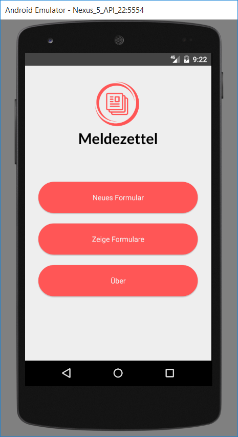
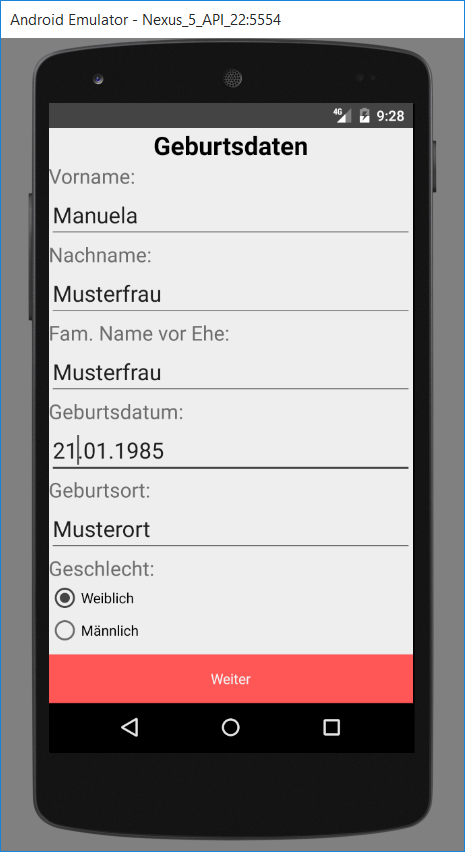
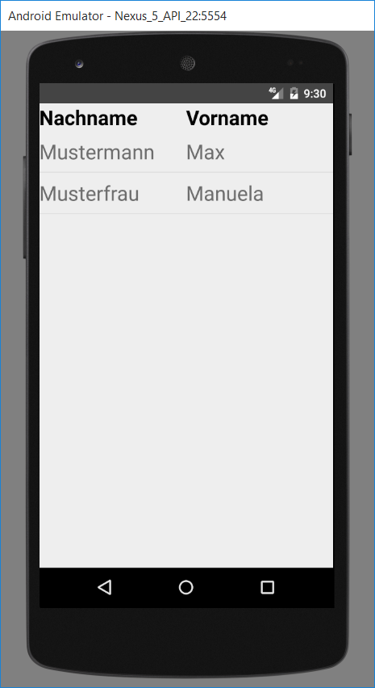

## Inhalt
1. [Description](#Description)
2. [Prerequisites](#Prerequisites)
3. [Licenses](#licenses)
4. [Contributors](#contributors)
5. [Screenshots](#screenshots)
6. [FAQ](#faq)
7. [Release](#release)

___

##Description
This android app is used to fill the austrian "Meldezettel" with your personal data.
You can view and delete previously saved "Meldezettel"
___

##Prerequisites
Used software is android studio. Programming was done in Java and Scala.
(But mostly Java)

##Licenses

https://github.com/SKogelnik/resifo-android/blob/master/LICENSE.txt

## Contributors
Stefan Kogelnik

Fabian Schopper

___
## Screenshots

###Welcome Screen

###Summary Screen

###Input Screen

###List of Formulars

##FAQ
F: Gibt es diese App auch für iOs?

A: Nein.

F: Funktioniert diese App auch auf meinem Android 4.0 ?

A: Nein. Wir unterstützen ab API 15.

F: Ich habe einen Fehler gefunden.

A: Bitte mail an stefan(dot)kogelnik(at)fh-joanneum(dot)at
___
##Release
### Version 1.0 ist mit 05.02.2017 released.
___
